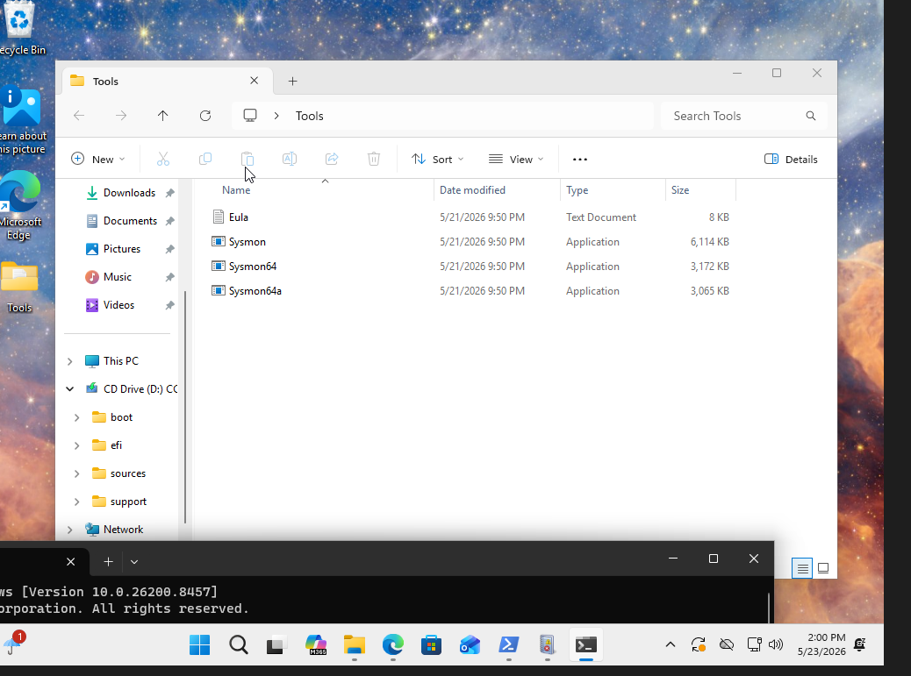
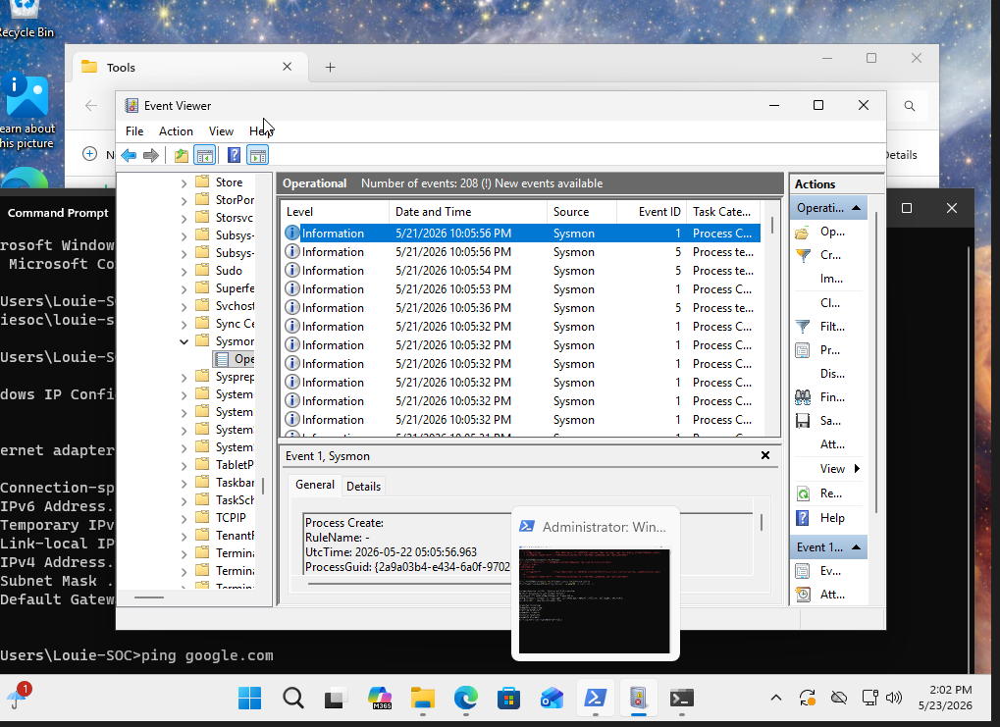
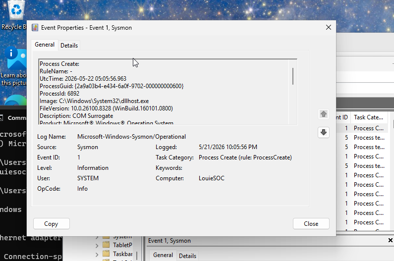
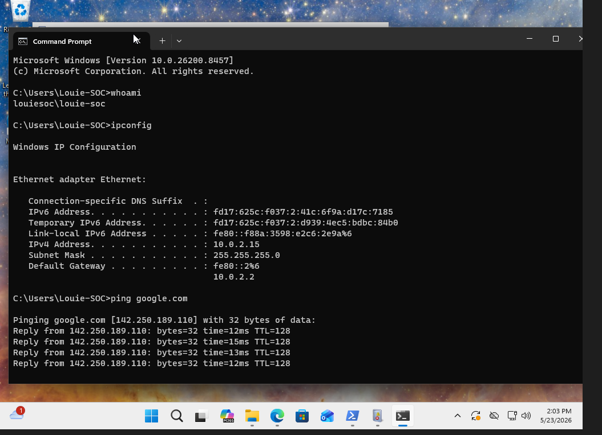

# Home-SOC-Lab
Built a Home SOC Lab using VirtualBox, Windows 11, Sysmon, and Event Viewer to generate and analyze endpoint telemetry.

## Project Overview
This project documents my process of building a Home Security Operations Center (SOC) lab using VirtualBox and Windows 11. The goal of this lab was to gain hands-on experience with endpoint monitoring, Sysmon logging, and Windows Event analysis.

## Objectives
- Create a Windows-based virtual machine
- Install and configure Sysmon
- Generate and analyze Windows events
- Use Event Viewer to inspect process activity
- Build a foundation for future SIEM integration (Splunk)

## Tools Used
- Oracle VirtualBox
- Windows 11 VM
- Sysmon
- Event Viewer
- PowerShell

## Setup Process
1. Created a Windows 11 virtual machine in VirtualBox
2. Installed and configured Windows
3. Installed Sysmon
4. Enabled Sysmon logging
5. Opened Event Viewer
6. Navigated to:

Applications and Services Logs → Microsoft → Windows → Sysmon → Operational

7. Observed Event IDs and process activity

## Findings

### Event ID 1 — Process Creation
Event ID 1 logs process creation activity including:
- Process name
- Process ID
- Command line activity
- Parent process relationships

### Event ID 5 — Process Terminated
Event ID 5 logs process termination activity.

## Screenshots

### Sysmon Installed

### Event Viewer Sysmon Logs

### Process Creation Event

### Command Activity

## Skills Demonstrated
- Windows administration
- Virtual machine deployment
- Endpoint monitoring
- Security event analysis
- PowerShell usage
- Log analysis

## Future Improvements
- Integrate Splunk SIEM
- Add Sysmon custom configurations
- Simulate attacks and detect activity
- Create dashboards and alerts
